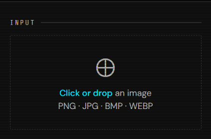
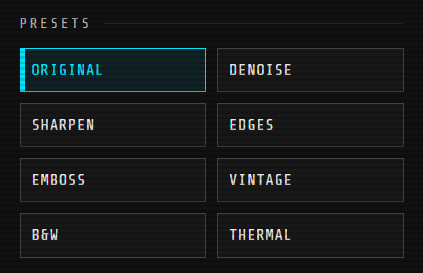
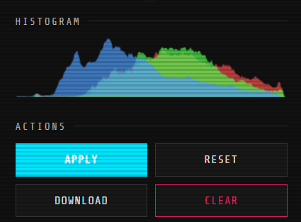

# Image Filtering Website

A browser-based image filtering and processing application built using **HTML, CSS, and JavaScript**.  
The project allows users to upload images, apply filters, perform morphological operations, thresholding, histogram analysis, and download processed results in real time.

---

# Features

- Real-time image filtering
- Drag and drop image upload
- Preset filters
- Brightness, contrast, saturation, and hue adjustments
- Blur and sharpening filters
- Noise reduction using median filtering
- Morphological operations
- Thresholding techniques
- RGB histogram visualization
- Split-screen comparison mode
- Pixel inspector
- Image download support

---

# Upload & Drag-Drop System

## Description
This section handles image uploading and drag-drop functionality.

It:
- Reads image files
- Loads images into the canvas
- Initializes the filtering pipeline

## Main Function

```javascript
function loadFile(file)
```

## How It Works
- `FileReader()` reads the uploaded image
- `Image()` creates an image object
- Canvas size matches the uploaded image
- The image is drawn on the canvas
- Filters are automatically applied

## Screenshot

```md



```

---

# Preset Filter System

## Description
The preset system applies predefined combinations of filters and effects.

Available presets:
- Original
- Denoise
- Sharpen
- Edges
- Emboss
- Vintage
- Grayscale
- Thermal

## Main Object

```javascript
const PRESETS = { ... }
```

## How It Works
Each preset stores:
- Brightness
- Contrast
- Saturation
- Blur
- Sharpening
- Noise reduction
- Morphological settings
- Threshold settings

When a preset button is clicked:
1. UI controls update automatically
2. Slider values change
3. Filters are reapplied

## Screenshot

```md

```

---

# Real-Time Adjustment Sliders

## Description
Allows users to manually adjust image properties in real time.

Supported adjustments:
- Brightness
- Contrast
- Saturation
- Hue rotation
- Blur
- Sharpening
- Noise reduction

## Main Event Listener

```javascript
controls.brightness.addEventListener('input', applyFilters)
```

## How It Works
- Slider values update instantly
- Image processing runs automatically
- The canvas refreshes in real time

## Screenshot

```md

```

---

# Convolution & Image Processing Engine

## Description
This is the core image processing system responsible for kernel-based filtering.

Used for:
- Sharpening
- Edge enhancement
- Embossing
- Pixel-level image processing

## Main Function

```javascript
function convolve(data, w, h, kernel, kSize)
```

## How It Works
The function:
1. Reads neighboring pixels
2. Applies mathematical kernels
3. Calculates new pixel values
4. Generates filtered output

## Screenshot

```md

```

---

# Median Filter (Noise Reduction)

## Description
Reduces image noise using the median filtering algorithm.

Useful for:
- Salt-and-pepper noise removal
- Grain reduction
- Smoother outputs

## Main Function

```javascript
function medianFilter(data, w, h, r)
```

## How It Works
The algorithm:
1. Collects nearby pixel values
2. Sorts them
3. Finds the median value
4. Replaces noisy pixels

## Screenshot

```md

```

---

# Morphological Operations

## Description
Implements classical image morphology techniques.

Supported operations:
- Erosion
- Dilation
- Opening
- Closing
- Morphological Gradient

## Main Function

```javascript
function morphOp(data, w, h, op, kSize)
```

## Operations

### Erosion
Shrinks bright regions and removes small white noise.

### Dilation
Expands bright regions and fills gaps.

### Opening

```text
Erosion → Dilation
```

Used for removing small bright noise.

### Closing

```text
Dilation → Erosion
```

Used for filling small dark holes.

### Gradient
Extracts object boundaries using:

```text
Dilation − Erosion
```

## Screenshot

```md

```

---

# Thresholding System

## Description
Converts images into binary black-and-white outputs.

Supported methods:
- Binary Thresholding
- Otsu Thresholding
- Adaptive Thresholding

## Main Function

```javascript
function threshold(data, w, h, method, channel, tVal)
```

## Thresholding Methods

### Binary Threshold
Uses a fixed threshold value.

### Otsu Threshold
Automatically calculates the optimal threshold.

### Adaptive Threshold
Uses local neighborhood brightness values.

## Screenshot

```md

```

---

# Histogram Visualization

## Description
Displays RGB color distribution of the image.

## Main Function

```javascript
function drawHistogram(data)
```

## How It Works
The histogram:
- Counts pixel intensity frequencies
- Separates RGB channels
- Visualizes color distribution

Useful for:
- Contrast analysis
- Exposure checking
- Color balance evaluation

## Screenshot

```md

```

---

# Split View Comparison

## Description
Allows comparison between the original and processed image.

## Main Function

```javascript
function updateSplitView(img, w, h)
```

## How It Works
- Creates an overlay canvas
- Displays original image on one side
- Displays filtered image on the other side

Useful for visual comparison and analysis.

## Screenshot

```md

```

---

# Main Filter Pipeline

## Description
This is the central processing workflow of the entire application.

## Main Function

```javascript
function _doApply()
```

## Processing Pipeline

```text
Image Upload
    ↓
CSS Filters
    ↓
Sharpening
    ↓
Noise Reduction
    ↓
Morphological Operations
    ↓
Thresholding
    ↓
Histogram Generation
    ↓
Canvas Rendering
```

## How It Works
This function:
- Reads all control values
- Applies processing stages sequentially
- Updates the canvas
- Measures processing time
- Updates UI information

This is the core engine of the project.

## Screenshot

```md

```

---

# Download & Export System

## Description
Allows users to export processed images.

## Main Code

```javascript
mainCanvas.toDataURL('image/png')
```

## How It Works
- Canvas data is converted into PNG format
- The image is downloaded locally

## Screenshot

```md

```

---

# Pixel Inspector

## Description
Displays:
- Pixel coordinates
- RGB values
- Zoom percentage

## Main Event

```javascript
mainCanvas.addEventListener('mousemove', e => {})
```

## How It Works
As the mouse moves:
- Pixel coordinates are calculated
- RGB values are extracted
- Information is displayed in real time

Useful for image analysis and debugging.

## Screenshot

```md

```

---

# Technologies Used

- HTML5
- CSS3
- JavaScript
- Canvas API
- Image Processing Algorithms
- Morphological Operations
- Thresholding Techniques

---

# Suggested Screenshot Folder Structure

```text
images/
├── upload-system.png
├── preset-filters.png
├── sliders.png
├── convolution.png
├── noise-reduction.png
├── morphology.png
├── thresholding.png
├── histogram.png
├── split-view.png
├── pipeline.png
├── download.png
└── pixel-inspector.png
```
